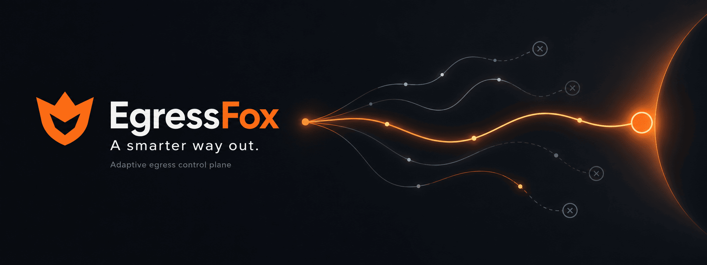

<p align="center">
  
</p>

<p align="center">
  <strong>Adaptive egress control plane for reliable external connectivity.</strong>
</p>


<div align="center">

  <a href="https://github.com/egressfox-io/egressfox/actions/workflows/check.yml">
    
  </a>
  <a href="https://github.com/egressfox-io/egressfox/blob/main/LICENSE">
    
  </a>
  
  
  

  <br>

  <a href="./go.mod">
    
  </a>
  <a href="https://github.com/egressfox-io/egressfox">
    
  </a>
  
  

  <br>

  <a href="https://github.com/egressfox-io/egressfox">
    
  </a>
  <a href="https://github.com/egressfox-io/egressfox/commits/main">
    
  </a>
  <a href="https://github.com/egressfox-io/egressfox/issues">
    
  </a>
  <a href="https://github.com/egressfox-io/egressfox/pulls">
    
  </a>
  <a href="https://github.com/egressfox-io/egressfox/graphs/contributors">
    
  </a>

</div>


> [!CAUTION]
> **Pre-alpha — active development.**
>
> EgressFox is under active development. Core functionality is implemented,
> but public releases, API stability, and production readiness are not yet
> guaranteed.
>
> Breaking changes may occur without prior notice.
---

EgressFox discovers external proxy endpoints, observes their destination-specific
health, retains historical evidence, and adaptively selects a stable usable set.

It renders and validates configuration for **Mihomo** and **sing-box**. Today the
Go core supports standalone reconciliation and the Kubernetes operator provides
BYO Secret publication plus an explicit managed Gateway. A user-facing standalone
CLI/daemon and broader external publishers are accepted future architecture, not
current release capabilities.
## Why EgressFox?

External integrations sometimes depend on gateways that rotate credentials,
disappear, slow down, flap, or fail only for particular destinations. A static list
cannot distinguish stale evidence from a confirmed failure, and manually replacing
endpoints makes behavior difficult to reproduce.

EgressFox turns endpoint descriptions into revision-aware evidence and deterministic
selection decisions. It applies stability controls before publishing a new,
engine-native configuration, while preserving the last known good output when a
candidate is invalid.

Mihomo and sing-box remain the data plane: they implement protocols and move traffic.
EgressFox is the control plane that decides which validated configuration should
exist.

## Current capabilities

| Area | Implemented contract |
| --- | --- |
| Endpoints | VLESS and Trojan over TCP or WebSocket, with bounded TLS/SNI options |
| Sources | URI lists and Base64 URI lists; same-namespace Secret snapshots or managed conditional HTTP refresh with a protected, time-bounded cache |
| Evidence | Revision- and destination-specific probes, bounded scheduling, SQLite history and freshness-aware summaries |
| Selection | Static, lowest-latency, and deterministic adaptive Top-N strategies with residence, hysteresis, cooldown and emergency replacement |
| Rendering | Exact Mihomo 1.19.31 and sing-box-compatible 1.14.1 profiles with native validation |
| Publication | Recoverable file output in the core; owner-checked Kubernetes Secret output with last-known-good preservation |
| Kubernetes | Namespace-scoped `egressfox.io/v1alpha1` operator, explicit managed or BYO Gateways, exact-generation activation, Helm chart, scoped RBAC, retained RWO state PVC |
| Release path | linux/amd64 and linux/arm64 builds, SPDX SBOMs, vulnerability gates, checksums, keyless signing and provenance workflow |

Versions or protocols not listed above may work upstream but are unsupported by
EgressFox until their renderer and native compatibility profile are tested.

## Intentionally not implemented

- Managed replicas greater than one, live reload, PDB/topology controls, external
  Services, HTTP proxy listeners, or traffic-level health claims.
- Transparent interception, TProxy automation, eBPF integration, sidecar injection,
  or arbitrary workload routing.
- Rich routing composition, native escape hatches, additional proxy protocols, or
  cross-namespace references.
- A user-facing standalone product CLI/daemon, Vault/S3 publishers, or
  `EgressOutput`; these are post-P1 architecture directions, not implemented APIs.
- Highly available operators, shared SQLite, a Web UI, or a rich general-purpose
  product CLI in the committed P1 path.

See the [roadmap](docs/roadmap/README.md) for later horizons. Planned work is not a
current compatibility promise.

## Evaluate locally

There is no public image or chart download yet. To inspect the code and run the
normal repository gate, install Git, Make, Python 3.9 or newer, Go 1.27.1, Helm,
and a C compiler:

```sh
git clone https://github.com/egressfox-io/egressfox.git
cd egressfox
make check
```

To exercise the complete Kubernetes flow, also install Docker and `kubectl`, then
run:

```sh
make test-envtest
make e2e-kind
```

The kind test creates an isolated pinned Kubernetes 1.32 cluster by default, installs/upgrades the
chart, checks negative RBAC and BYO compatibility, proxies controlled traffic
through both managed engines, verifies authentication, failed-rollout LKG, repair,
restart and mode transitions, and exercises conditional HTTP source refresh,
fallback and expiry. It deletes the cluster when complete.

After the first approved alpha is published, use the verified image digest and Helm
package described in the [release guide](docs/operations/releasing.md). Do not deploy
an invented `latest` tag.

## Kubernetes model

The operator watches one namespace. A `ProxyPool` reads endpoint and probe-target
Secrets; an `EgressGateway` selects an exact engine profile and explicitly opts into
the managed runtime:

```yaml
apiVersion: egressfox.io/v1alpha1
kind: ProxyPool
metadata:
  name: external-api
spec:
  sources:
    - id: primary
      secretRef: {name: endpoint-subscription, key: nodes}
      format: URIList
  probe:
    targetSecretRef: {name: external-api-probe, key: url}
    expectedStatus: 204
  selection: {strategy: Adaptive, topN: 2}
  refreshInterval: 5m
---
apiVersion: egressfox.io/v1alpha1
kind: EgressGateway
metadata:
  name: external-api
spec:
  poolRef: {name: external-api}
  engine: SingBox
  runtime:
    managed: {}
```

The referenced Secrets contain credentials and must be created through your secret
management workflow. Managed mode creates one authenticated SOCKS5 Service; status
reports its name, the client-auth Secret and distinct published/active generations.
Applications explicitly configure that proxy. Omit `runtime` and provide the legacy
loopback `listener` plus `outputSecretName` to retain BYO behavior. See the
[sanitized samples](config/samples/README.md) and the [operator guide](docs/operations/kubernetes.md).

## Adaptive selection

“Adaptive” here is a deterministic policy, not machine learning. Decisions use a
bounded historical window for the exact endpoint revision, destination, probe
profile, and execution vantage. Hard eligibility is applied before scoring;
residence, improvement thresholds, cooldown, and recovery evidence reduce churn
without preventing emergency replacement of a failing incumbent.

The algorithm and replay guarantees are specified in
[ADR 0010](docs/decisions/0010-deterministic-adaptive-selection.md).

## Security model

EgressFox treats subscriptions, endpoint credentials, generated configuration, and
private revisions as sensitive. Untrusted inputs are bounded, network targets are
authorized before dialing, diagnostics are credential-safe, generated artifacts are
natively validated, and invalid candidates never displace the last-known-good
output. The operator runs non-root with namespace-scoped RBAC and owner-checked
Secret publication.

Read [SECURITY.md](SECURITY.md) before reporting a sensitive issue and see the
[threat model](docs/security/threat-model.md) for residual risks.

## Project status and roadmap

P0 milestones M1–M6, post-M6 release hardening, P1 M7 managed
gateway/activation and M8 resilient HTTP source refresh are complete. The current
API is `v1alpha1`; Kubernetes 1.32, 1.34 and 1.37 are release-qualification
profiles, and the project is not production-certified. M9 target-aware selection
profiles are the next implementation unit. See the
[P1 roadmap](docs/roadmap/p1.md).

## Documentation

| Topic | Start here |
| --- | --- |
| Product boundaries and architecture | [Product](docs/product.md) · [Architecture](docs/architecture.md) |
| Kubernetes installation and operation | [Operator guide](docs/operations/kubernetes.md) |
| Supported versions and release verification | [Release guide](docs/operations/releasing.md) · [Versioning](docs/operations/versioning.md) · [Kubernetes compatibility](docs/operations/kubernetes-compatibility.md) |
| Security | [Security policy](SECURITY.md) · [Threat model](docs/security/threat-model.md) |
| Decisions and roadmap | [ADR index](docs/decisions/README.md) · [Roadmap](docs/roadmap/README.md) |
| Development | [Contributing](CONTRIBUTING.md) · [Testing](docs/development/testing.md) |

The complete curated index is in [docs/README.md](docs/README.md).

## Contributing and support

Contributions are welcome while the project is alpha. Start with
[CONTRIBUTING.md](CONTRIBUTING.md); use [SUPPORT.md](SUPPORT.md) to choose the right
place for bugs, proposals, questions, or security reports.

## License

EgressFox is licensed under [Apache-2.0](LICENSE). Source-built engine derivatives
inside release images remain subject to their upstream GPL terms and corresponding-
source requirements; see [THIRD_PARTY_NOTICES.md](THIRD_PARTY_NOTICES.md).

---

<div align="center">

[Contributing](CONTRIBUTING.md) ·
[Maintainers](MAINTAINERS.md) ·
[Changelog](CHANGELOG.md) ·
[Security](SECURITY.md) ·
[License](LICENSE)

</div>
