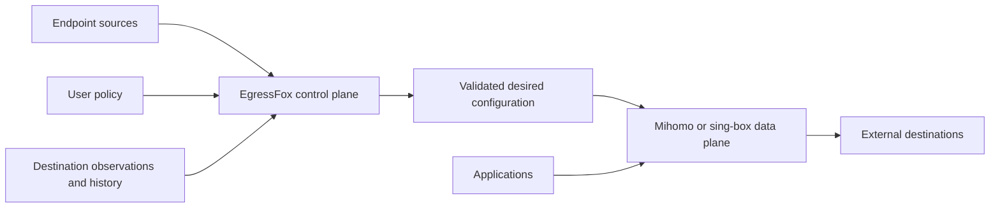

# EgressFox

**A control plane for reliable, policy-driven proxy/VPN egress.**

EgressFox is being built to discover, monitor, evaluate, and select external
endpoints, then continuously produce the desired configuration for Mihomo and
sing-box. It aims to replace fragile static endpoint lists with decisions based
on policy, destination-aware observations, and historical network behavior.

> **EgressFox decides what configuration should exist. Mihomo or sing-box decides
> how traffic flows through it.**

**Status: P0 milestones M1–M6 implemented.** The repository contains the bounded
path from source admission through identity, native probes, SQLite evidence,
deterministic adaptive selection, validated Mihomo/sing-box artifacts, recoverable
file publication, and a namespace-scoped Kubernetes BYO operator with owned Secret
output. Runtime activation is deliberately unobserved; there is no managed gateway
workload or product CLI. Project domain: `egressfox.io`.



## Why EgressFox

An endpoint can work for one destination and fail for another. Providers disappear,
latency changes, endpoints flap, and seemingly diverse gateways share failure
domains. EgressFox is intended to make endpoint selection reproducible and stable
while allowing prompt replacement after confirmed failure.

Use cases include resilient third-party API access, multi-provider redundancy,
regional integration testing, geo-aware egress, centralized Kubernetes egress,
and hybrid/multi-cloud networking. EgressFox will configure existing engines;
proxy protocols, connection forwarding, balancing, and packet handling remain
the engines' responsibility.

## What exists and what is planned

| Stage | Contents |
| --- | --- |
| Present | M1–M6 core pipeline, both pinned renderers, file/Secret publication, SQLite history/selection, namespace-scoped BYO operator, generated CRDs, Helm and integration tests |
| Release hardening | Image provenance/SBOM/signing, dependency/license review, supported-version evidence and private security handling |
| Later or experimental | Managed engines, richer policy/diversity and explain tooling, additional outputs, HA, PostgreSQL, UIs, and advanced networking integrations |

Kubernetes is an integration over the same core as standalone mode. Initial
connectivity will use explicit application proxy settings. Transparent interception,
TProxy automation, and eBPF integration are future research areas.

## Start here

- [Documentation map](docs/README.md) — authoritative product, architecture, and design sources.
- [Implementation roadmap](docs/roadmap/README.md) — milestone outcomes and later horizons.
- [Kubernetes operator guide](docs/operations/kubernetes.md) — installation, APIs,
  ownership, security and recovery.
- [Contributing](CONTRIBUTING.md) — branch, design, test, and commit expectations.
- [Agent instructions](AGENTS.md) — compact navigation and operating contract.
- [Security](SECURITY.md) — reporting limitations and threat-model entry point.

## Check the foundation

Install Git, Make, and the Go version pinned in [go.mod](go.mod); race tests also
require a C compiler. See [setup and workflow](docs/development/workflow.md).

```sh
make check
make vuln
```

These validate generation drift, all Go domains, documentation and the Helm chart.
`make test-envtest` and `make e2e-kind` run Kubernetes integration layers. The
vulnerability and integration setup commands need network access.

## License

EgressFox retains the repository's existing [Apache License 2.0](LICENSE).
