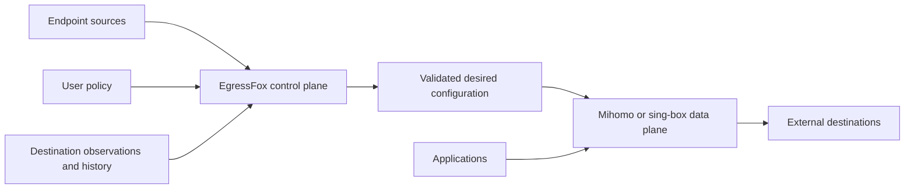

# EgressFox

**A control plane for reliable, policy-driven proxy/VPN egress.**

EgressFox is being built to discover, monitor, evaluate, and select external
endpoints, then continuously produce the desired configuration for Mihomo and
sing-box. It aims to replace fragile static endpoint lists with decisions based
on policy, destination-aware observations, and historical network behavior.

> **EgressFox decides what configuration should exist. Mihomo or sing-box decides
> how traffic flows through it.**

**Status: repository foundation only.** Architecture, engineering guidance, and
development checks are present. There is no working EgressFox CLI, operator,
renderer, or gateway deployment yet. Project domain: `egressfox.io`.



## Why EgressFox

An endpoint can work for one destination and fail for another. Providers disappear,
latency changes, endpoints flap, and seemingly diverse gateways share failure
domains. EgressFox is intended to make endpoint selection reproducible and stable
while allowing prompt replacement after confirmed failure.

Use cases include resilient third-party API access, multi-provider redundancy,
regional integration testing, geo-aware egress, centralized Kubernetes egress,
and hybrid/multi-cloud networking. EgressFox will configure existing engines;
proxy protocols, connection forwarding, balancing, and packet handling remain
the engines' responsibility.

## What exists and what is planned

| Stage | Contents |
| --- | --- |
| Present | Product/design documentation, ADRs, threat model, agent/contributor workflow, execution plans, Go-based documentation checker, and CI configuration |
| Planned P0 | Standalone core and CLI, endpoint acquisition/identity, destination-aware probes, SQLite history, adaptive selection, both renderers, validated file/Secret publication, and a Kubernetes operator for BYO runtimes |
| Later or experimental | Managed engines, richer policy/diversity and explain tooling, additional outputs, HA, PostgreSQL, UIs, and advanced networking integrations |

Kubernetes is an integration over the same core as standalone mode. Initial
connectivity will use explicit application proxy settings. Transparent interception,
TProxy automation, and eBPF integration are future research areas.

## Start here

- [Documentation map](docs/README.md) — authoritative product, architecture, and design sources.
- [Implementation roadmap](docs/roadmap/README.md) — dependencies and exit criteria; M1 endpoint identity is next.
- [Contributing](CONTRIBUTING.md) — branch, design, test, and commit expectations.
- [Agent instructions](AGENTS.md) — compact navigation and operating contract.
- [Security](SECURITY.md) — reporting limitations and threat-model entry point.

## Check the foundation

Install Git, Make, and the Go version pinned in [go.mod](go.mod); race tests also
require a C compiler. See [setup and workflow](docs/development/workflow.md).

```sh
make check
make vuln
```

These validate repository tooling and documentation. They do not run a gateway.
The vulnerability check needs network access. All commands and their limits are
documented in the development guide.

## License

EgressFox retains the repository's existing [Apache License 2.0](LICENSE).
