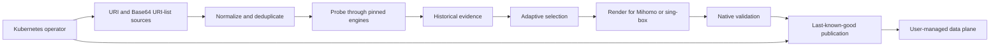

# EgressFox

**Adaptive egress control plane for reliable external connectivity.**

[](https://github.com/egressfox-io/egressfox/actions/workflows/check.yml)
[](go.mod)
[](LICENSE)

EgressFox ingests external proxy endpoint sources, measures destination-specific
connectivity, retains historical evidence, selects a stable usable set, and renders
validated desired configuration for Mihomo or sing-box. Its Kubernetes operator
publishes that configuration for a runtime you manage.

> **Pre-release alpha.** The P0 control-plane path and release machinery are
> implemented, but no public release or production-support commitment exists yet.

## Why EgressFox?

External integrations sometimes depend on gateways that rotate credentials,
disappear, slow down, flap, or fail only for particular destinations. A static list
cannot distinguish stale evidence from a confirmed failure, and manually replacing
endpoints makes behavior difficult to reproduce.

EgressFox turns endpoint descriptions into revision-aware evidence and deterministic
selection decisions. It applies stability controls before publishing a new,
engine-native configuration, while preserving the last known good output when a
candidate is invalid.

Mihomo and sing-box remain the data plane: they implement protocols and move traffic.
EgressFox is the control plane that decides which validated configuration should
exist.

## How it works



The core endpoint, observation, selection, rendering, and reconciliation packages do
not depend on Kubernetes. The operator adapts same-namespace Secrets and alpha CRDs
to that core and publishes an owned Secret; it does not create or reload an engine
workload.

## Current capabilities

| Area | Implemented P0 contract |
| --- | --- |
| Endpoints | VLESS and Trojan over TCP or WebSocket, with bounded TLS/SNI options |
| Sources | URI lists and Base64 URI lists; bounded HTTP acquisition in the core and same-namespace Secret ingestion in Kubernetes |
| Evidence | Revision- and destination-specific probes, bounded scheduling, SQLite history and freshness-aware summaries |
| Selection | Static, lowest-latency, and deterministic adaptive Top-N strategies with residence, hysteresis, cooldown and emergency replacement |
| Rendering | Exact Mihomo 1.19.31 and sing-box-compatible 1.14.1 profiles with native validation |
| Publication | Recoverable file output in the core; owner-checked Kubernetes Secret output with last-known-good preservation |
| Kubernetes | Namespace-scoped `egressfox.io/v1alpha1` operator, Helm chart, scoped RBAC, retained RWO state PVC |
| Release path | linux/amd64 and linux/arm64 builds, SPDX SBOMs, vulnerability gates, checksums, keyless signing and provenance workflow |

Versions or protocols not listed above may work upstream but are unsupported by
EgressFox until their renderer and native compatibility profile are tested.

## Intentionally not implemented

- Managed Mihomo or sing-box Deployments, Services, reloads, or activation
  acknowledgement.
- Transparent interception, TProxy automation, eBPF integration, sidecar injection,
  or arbitrary workload routing.
- Rich routing composition, native escape hatches, additional proxy protocols, or
  cross-namespace references.
- Highly available operators, shared SQLite, a Web UI, or a general product CLI.

See the [roadmap](docs/roadmap/README.md) for later horizons. Planned work is not a
current compatibility promise.

## Evaluate locally

There is no public image or chart download yet. To inspect the code and run the
normal repository gate, install Git, Make, Go 1.27.1, Helm, and a C compiler:

```sh
git clone https://github.com/egressfox-io/egressfox.git
cd egressfox
make check
```

To exercise the complete Kubernetes flow, also install Docker and `kubectl`, then
run:

```sh
make test-envtest
make e2e-kind
```

The kind test creates an isolated Kubernetes 1.37.0 cluster, installs the chart,
checks namespace-scoped RBAC, proxies controlled traffic through the bundled
sing-box-compatible engine, verifies restart and last-known-good behavior, and
deletes the cluster when complete.

After the first approved alpha is published, use the verified image digest and Helm
package described in the [release guide](docs/operations/releasing.md). Do not deploy
an invented `latest` tag.

## Kubernetes model

The operator watches one namespace. A `ProxyPool` reads endpoint and probe-target
Secrets; an `EgressGateway` selects an exact engine profile and names its output
Secret:

```yaml
apiVersion: egressfox.io/v1alpha1
kind: ProxyPool
metadata:
  name: external-api
spec:
  sources:
    - id: primary
      secretRef: {name: endpoint-subscription, key: nodes}
      format: URIList
  probe:
    targetSecretRef: {name: external-api-probe, key: url}
    expectedStatus: 204
  selection: {strategy: Adaptive, topN: 2}
  refreshInterval: 5m
---
apiVersion: egressfox.io/v1alpha1
kind: EgressGateway
metadata:
  name: external-api
spec:
  poolRef: {name: external-api}
  engine: SingBox
  listener: {address: 127.0.0.1, port: 1080}
  outputSecretName: external-api-engine-config
```

The referenced Secrets contain credentials and must be created through your secret
management workflow. The operator writes validated `config.yaml` or `config.json`
bytes, but the user-managed engine workload is responsible for mounting and loading
them. See the [sanitized samples](config/samples/README.md) and the
[operator guide](docs/operations/kubernetes.md).

## Adaptive selection

“Adaptive” here is a deterministic policy, not machine learning. Decisions use a
bounded historical window for the exact endpoint revision, destination, probe
profile, and execution vantage. Hard eligibility is applied before scoring;
residence, improvement thresholds, cooldown, and recovery evidence reduce churn
without preventing emergency replacement of a failing incumbent.

The algorithm and replay guarantees are specified in
[ADR 0010](docs/decisions/0010-deterministic-adaptive-selection.md).

## Security model

EgressFox treats subscriptions, endpoint credentials, generated configuration, and
private revisions as sensitive. Untrusted inputs are bounded, network targets are
authorized before dialing, diagnostics are credential-safe, generated artifacts are
natively validated, and invalid candidates never displace the last-known-good
output. The operator runs non-root with namespace-scoped RBAC and owner-checked
Secret publication.

Read [SECURITY.md](SECURITY.md) before reporting a sensitive issue and see the
[threat model](docs/security/threat-model.md) for residual risks.

## Project status and roadmap

P0 milestones M1–M6 and post-M6 release hardening are complete. The current API is
`v1alpha1`, Kubernetes 1.37.0 is the tested baseline, and the project is not
production-certified. The next unit of work is P1 design; no P1 feature is implied
by the current repository.

## Documentation

| Topic | Start here |
| --- | --- |
| Product boundaries and architecture | [Product](docs/product.md) · [Architecture](docs/architecture.md) |
| Kubernetes installation and operation | [Operator guide](docs/operations/kubernetes.md) |
| Supported versions and release verification | [Release guide](docs/operations/releasing.md) |
| Security | [Security policy](SECURITY.md) · [Threat model](docs/security/threat-model.md) |
| Decisions and roadmap | [ADR index](docs/decisions/README.md) · [Roadmap](docs/roadmap/README.md) |
| Development | [Contributing](CONTRIBUTING.md) · [Testing](docs/development/testing.md) |

The complete curated index is in [docs/README.md](docs/README.md).

## Contributing and support

Contributions are welcome while the project is alpha. Start with
[CONTRIBUTING.md](CONTRIBUTING.md); use [SUPPORT.md](SUPPORT.md) to choose the right
place for bugs, proposals, questions, or security reports.

## License

EgressFox is licensed under [Apache-2.0](LICENSE). Source-built engine derivatives
inside release images remain subject to their upstream GPL terms and corresponding-
source requirements; see [THIRD_PARTY_NOTICES.md](THIRD_PARTY_NOTICES.md).
