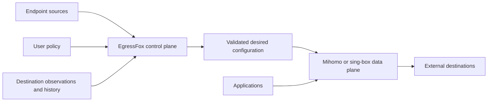

# EgressFox

**A control plane for reliable, policy-driven proxy/VPN egress.**

EgressFox is being built to discover, monitor, evaluate, and select external
endpoints, then continuously produce the desired configuration for Mihomo and
sing-box. It aims to replace fragile static endpoint lists with decisions based
on policy, destination-aware observations, and historical network behavior.

> **EgressFox decides what configuration should exist. Mihomo or sing-box decides
> how traffic flows through it.**

**Status: pre-release alpha; P0 milestones M1–M6 implemented.** The repository contains the bounded
path from source admission through identity, native probes, SQLite evidence,
deterministic adaptive selection, validated Mihomo/sing-box artifacts, recoverable
file publication, and a namespace-scoped Kubernetes BYO operator with owned Secret
output plus a non-publishing release construction and verification path. Runtime
activation is deliberately unobserved; there is no managed gateway workload or
product CLI. Project domain: `egressfox.io`.



## Why EgressFox

An endpoint can work for one destination and fail for another. Providers disappear,
latency changes, endpoints flap, and seemingly diverse gateways share failure
domains. EgressFox is intended to make endpoint selection reproducible and stable
while allowing prompt replacement after confirmed failure.

Use cases include resilient third-party API access, multi-provider redundancy,
regional integration testing, geo-aware egress, centralized Kubernetes egress,
and hybrid/multi-cloud networking. EgressFox will configure existing engines;
proxy protocols, connection forwarding, balancing, and packet handling remain
the engines' responsibility.

## What exists and what is planned

| Stage | Contents |
| --- | --- |
| Present | M1–M6 core pipeline, both pinned renderers, file/Secret publication, SQLite history/selection, namespace-scoped BYO operator, generated CRDs, Helm and integration tests |
| Release hardening | Exact engine/source/license manifest, multi-architecture image, SBOM/scans, checksums, protected keyless signing/provenance workflow and private-reporting setup instructions |
| Later or experimental | Managed engines, richer policy/diversity and explain tooling, additional outputs, HA, PostgreSQL, UIs, and advanced networking integrations |

The supported engine profiles are exactly **Mihomo 1.19.31** and **sing-box
1.14.1**. The implemented endpoint slice is VLESS and Trojan over TCP or WebSocket,
with ordinary TLS options, admitted from URI-list or Base64 URI-list sources. Other
versions and protocols may exist upstream but are not supported. Kubernetes 1.37.0
is the tested cluster baseline.

Kubernetes is an integration over the same core as standalone mode. The current
experience is BYO: EgressFox publishes a credential-bearing configuration Secret,
and the user owns the engine workload, Secret mount and reload. Connectivity uses
explicit application proxy settings. Transparent interception,
TProxy automation, and eBPF integration are future research areas.

## Install the BYO operator

No public release is assumed by this repository state. For an approved alpha, verify
the image digest, signatures/provenance, SBOM and chart checksums using the
[release guide](docs/operations/releasing.md), then install one release per namespace:

```sh
helm upgrade --install egressfox ./egressfox-0.1.0-alpha.1.tgz \
  --namespace egressfox --create-namespace \
  --set image.repository=ghcr.io/egressfox-io/egressfox \
  --set image.digest=sha256:REPLACE_WITH_VERIFIED_DIGEST
```

Create same-namespace input Secrets and the sample `ProxyPool`/`EgressGateway`
resources under [`config/samples`](config/samples). The operator publishes an owned
Secret containing `config.yaml` or `config.json`; it does not create or confirm a
running proxy. CRDs and the retained state PVC require explicit lifecycle review.

## Start here

- [Documentation map](docs/README.md) — authoritative product, architecture, and design sources.
- [Implementation roadmap](docs/roadmap/README.md) — milestone outcomes and later horizons.
- [Kubernetes operator guide](docs/operations/kubernetes.md) — installation, APIs,
  ownership, security and recovery.
- [Release and verification guide](docs/operations/releasing.md) — support matrix,
  artifacts, dry run, SBOM/scans, signing/provenance and acceptance checklist.
- [Contributing](CONTRIBUTING.md) — branch, design, test, and commit expectations.
- [Agent instructions](AGENTS.md) — compact navigation and operating contract.
- [Security](SECURITY.md) — reporting limitations and threat-model entry point.

## Check the foundation

Install Git, Make, and the Go version pinned in [go.mod](go.mod); race tests also
require a C compiler. See [setup and workflow](docs/development/workflow.md).

```sh
make check
make vuln
VERSION=v0.1.0-alpha.1 make release-dry-run
```

The first two validate generation drift, all Go domains, documentation, Helm and Go
vulnerability reachability. The dry run builds and scans release artifacts without
publishing. `make test-envtest` and `make e2e-kind` run Kubernetes integration
layers. Vulnerability, release and integration setup commands need network access.

## License

EgressFox retains the repository's existing [Apache License 2.0](LICENSE). Bundled
source-built engine derivatives retain their GPL terms and complete modified source
is released with them; see [third-party notices](THIRD_PARTY_NOTICES.md).
