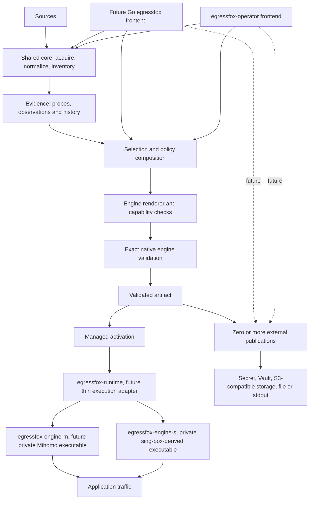

# Architecture and domain language

Status: M1–M8 core and Kubernetes behavior implemented; P1 M9–M12 designed; the
standalone/runtime/publication architecture is accepted future direction. [ADRs](decisions/README.md)
record durable boundaries; detailed designs distinguish shipped behavior from
requirements for later work.

## Product boundary

EgressFox is an adaptive egress control plane. Kubernetes is one deployment
frontend, not a product requirement. Standalone Linux, VM and container operation
is an intended first-class frontend over the same Kubernetes-independent Go core.
The standalone CLI/daemon is not implemented today.

**EgressFox decides what configuration should exist. Mihomo or sing-box decides
how traffic flows through it.** EgressFox may express bounded routing intent and
render engine-native configuration. It does not proxy application traffic, route
individual packets/connections, implement proxy protocols or perform adaptive
selection inside the runtime.

## System shape



The diagram combines current core stages with future composition/activation and
publication directions; it does not claim all shown processes or destinations
exist today. In particular, current M7 starts the engine directly, current release
image has no `egressfox` CLI or `egressfox-runtime`, and Vault/S3/stdout publishers
and `EgressOutput` are future work.

### Representative deployment flows

1. **Future one-shot CLI:** `egressfox inspect` or render-only `generate` composes
   the shared core without a daemon or engine. `probe` and native `validate` are
   independent capabilities and require a compatible engine only when invoked.
   Exact command syntax is open.
2. **Future standalone control plane:** `egressfox run` uses the shared core in
   publication-only mode or optional managed mode. Publication-only continuously
   refreshes sources, probes as configured, maintains history/selection, validates
   and publishes artifacts without owning a permanent Gateway. Managed mode also
   activates a persistent engine through the thin `egressfox-runtime`; the engine
   moves traffic. Both modes use real engine executables for native validation and
   actual endpoint probes when those capabilities run.
3. **Current managed Kubernetes:** `egressfox-operator` derives and validates the
   artifact, publishes it to an immutable internal generation Secret, and a
   one-replica Deployment starts the selected engine binary directly from the same
   release image. The stable Service exposes authenticated SOCKS. A future runtime
   wrapper may mediate engine execution.
4. **Future externally managed dataplane:** a CLI or operator publishes a validated
   artifact to Vault/S3/Secret/file. Consumer-owned sync/reload automation updates
   a separately managed engine. EgressFox does not claim or observe activation of
   that external workload.

## Artifact lifecycle

```text
render -> exact native validation -> Validated Artifact
                                       |             |
                                  Activation   External Publication
```

Activation and external publication are separate responsibilities. The same
validated bytes may be activated, published to one or more destinations, both, or
neither while reconciliation is incomplete. A destination does not independently
render the engine configuration. Probing asks whether a real endpoint reaches a
target; native validation asks whether the exact engine accepts the generated
configuration. They are independent.

Internal equality may use a protected exact-content fingerprint. Public status and
metadata use safe opaque generations/revisions; credential-derived config digests
are not exposed by default. A new validated artifact is not necessarily active. The
healthy LKG remains in service until a replacement is proven runtime-ready, and an
external publication failure must not destroy a healthy active dataplane.

M7's current `Published` Condition records exact validated bytes and a protected
receipt in the owned immutable generation Secret. It does not by itself mean the
runtime is active. Current BYO `outputSecretName` is the separate historical user
output behavior. Future external `EgressOutput` semantics are not implemented and
must not silently redefine either contract.

## Pool and policy composition

```text
Sources -> leaf ProxyPools -> target-aware Profiles -> candidate composition
        -> EgressPolicy -> EgressGateway desired artifact
```

One `ProxyPool` may contain multiple sources and remains a leaf inventory. Profiles
provide target/probe/selection context over the same inventory. Future candidate
groups may compose multiple `(Pool, Profile)` inputs; pools do not recursively
contain pools. Composition belongs to policy/selection intent, not inventory
ownership. A repeated full connection identity should render once per engine
configuration while retaining source provenance and each Pool/Profile/group
membership; different credential revisions remain distinct. Evaluate eligibility
and selection within each matching target/profile evidence context without
collapsing its measurements or scores into another context. Exact group/filter/
profile syntax is a future M9/M10 design gate; no `ProxyGroup` CRD is currently
planned.

## Terms

| Term | Meaning |
| --- | --- |
| Source | Configured origin of endpoint descriptions, including credential references and refresh policy |
| Endpoint | Normalized external connection configuration; not a Kubernetes EndpointSlice |
| Endpoint identity | Versioned logical endpoint ID plus a confidential connection revision; current health is revision-specific |
| Provenance | Sources and source-local records contributing an endpoint, with per-source presence times |
| Destination | Named target whose reachability matters; not automatically a probe URL |
| Probe profile | Versioned check definition, destination, timeout and success criteria |
| Observation | Measured result with endpoint/profile/revision, time, vantage and outcome |
| Health summary | Freshness-aware aggregation; unknown and stale differ from observed failure |
| Pool | Leaf candidate inventory and derivation policy, including filters, probes and selection intent |
| Profile | Target/probe/selection context applied to one shared inventory |
| Candidate composition | Future selection/policy union of one or more Pool/Profile inputs |
| Policy | Desired destination/routing/group intent independent of engine syntax |
| Gateway | Desired artifact and publication/runtime association |
| Validated artifact | Exact rendered bytes accepted by the exact engine/version validator |
| Private content identity | Protected exact-content/profile comparison value; not public metadata by default |
| Generation | Safe opaque artifact revision; distinct from content fingerprint, Kubernetes `metadata.generation`, publication receipt and active runtime generation |
| Last-known-good (LKG) | Retained validated artifact/runtime that most recently succeeded at the relevant publication or activation boundary |
| Activation | Evidence that a managed runtime loaded and can serve an exact generation; unknown for BYO without acknowledgment |
| External publication | Making the same validated payload available at a separately managed destination |

Detailed endpoint identity rules belong in
[endpoints and sources](designs/endpoints-and-sources.md). Probe outcomes and
selection belong in [observations and selection](designs/observations-and-selection.md).
Artifact and composition requirements belong in
[artifact publication and composition](designs/artifact-publication-and-composition.md).

## Component boundaries and code placement

There is one Go module. M1 implements `internal/endpoint`; M2 implements
`internal/source`; M3 is implemented by `internal/policy`, `internal/engine`,
`internal/artifact` and `internal/publish`; M4 by `internal/observation`,
`internal/probe` and `internal/state`; M5 by `internal/selection` and shared
`internal/reconcile`; M6 adds `api/v1alpha1`, `internal/controller`, Kubernetes
adapters in `internal/operator` and `cmd/operator`; M7 adds managed runtime planning
and exact activation in `internal/operator` plus the fixed `cmd/healthcheck` helper.
M8 extends `internal/source` for conditional fetching, `internal/state` for protected
HTTP cache, and the Kubernetes adapter/controller for bounded refresh scheduling.
`tools/checkdocs` is repository tooling. There is no product CLI or runtime wrapper
today.

| Responsibility | Intended location when implemented | Dependency constraint |
| --- | --- | --- |
| Normalized endpoint types and identity | `internal/endpoint` | No Kubernetes or engine imports |
| Acquisition and subscription parsers | `internal/source` | Produce normalized input; cannot publish output |
| Observation evidence and summaries | `internal/observation` | No scheduler or SQL dependency |
| Probe scheduling and engine execution | `internal/probe` | Pinned engines behind a narrow adapter; no proxy implementation |
| History and SQLite adapter | `internal/state` | Domain-shaped operations; no generic ORM |
| Eligibility, scoring and selection | `internal/selection` | Deterministic inputs; no I/O or Kubernetes types |
| Common routing intent and desired gateway | `internal/policy` | No native engine maps in common semantics |
| Engine config and validation | `internal/engine/*`, `internal/artifact` | Version-aware adapters; no publication side effects |
| File and Secret publication | `internal/publish` and current `internal/operator` adapter | Consume validated artifacts; serialize writes per target |
| Shared reconciliation/use cases | `internal/reconcile` | Explicit side-effect adapters; no Kubernetes client dependency |
| Standalone product frontend | Future `cmd/egressfox` | Thin Go CLI/process composition over shared core |
| Runtime process adapter | Future runtime command/package, exact placement open | Launch/lifecycle only; no control-plane decisions |
| Kubernetes API/reconcilers | `api/v1alpha1`, `internal/controller`, `internal/operator`, `cmd/operator` | Adapt Kubernetes objects to core; never invert dependency |
| Current readiness helper | `cmd/healthcheck` | Narrow authenticated local SOCKS check; not a general runtime supervisor |

These future paths are placement guidance, not directories to pre-create. Do not
introduce a generic `utils`, public SDK, empty interface for every pipeline stage,
plugin RPC protocol, or a service for each stage. Interfaces belong at real side
effect consumers. Control time/random input, use cancellable I/O, sanitized errors,
explicit dependencies and deterministic ordering.

## Reconciliation and consistency

The shared use case assembles an immutable input snapshot: desired policy revision,
source/inventory revisions, endpoint credential revisions, observation cutoff,
previous selection and engine compatibility profile. It derives a decision and
artifact without fetching mutable network data halfway through rendering. Repeating
the same effective snapshot and explicit time/seed produces the same decision and
bytes.

Before publication, reject obsolete work using current desired revisions and target
ownership. A slow render from older policy must not overwrite newer state. Writes
are serialized per target and ambiguous writes are read back. No transaction spans
history, filesystem, API server and engine; recoverable checkpoints preserve LKG.
The artifact design owns future content-aware no-op and same-generation repair.

## Failure boundaries

| Failure | Required response |
| --- | --- |
| Source timeout/invalid response | Record refresh failure; do not turn it into authoritative empty inventory |
| No fresh observations | Preserve unknown/stale evidence; apply explicit eligibility policy |
| Insufficient candidates | Report shortfall; never relax deny rules or route directly |
| Unsupported renderer semantics | Fail with safe capability/field context and retain current LKG |
| Native validation failure | Suppress publication and expose sanitized diagnostics |
| Publication conflict/ambiguous write | Read back and retry within bounds; do not promote blindly |
| Lost history | Apply explicit cold-start/recovery policy; do not fabricate healthy state |
| Candidate activation failure | Keep healthy active LKG; report candidate failure separately |
| External output failure | Report that destination independently; preserve healthy active dataplane |
| Data-plane/target failure after validation | Report separately where observable; validation is not availability proof |

## Standalone and Kubernetes

Standalone and operator modes compose the same core. Kubernetes adapts desired
inputs, scheduling signals, Secret access, output ownership, runtime lifecycle and
bounded status. The core must not know namespaces, CRD Conditions, API-server
resource versions or Kubernetes clients. M1–M5 core behavior is already
Kubernetes-independent; the user-facing standalone frontend remains future work.

P0 uses one namespace-scoped operator replica, leader election and one RWO-PVC-backed
SQLite store under [ADR 0011](decisions/0011-namespaced-byo-operator.md). This does
not authorize shared SQLite or multiple operator replicas.

## Design navigation and non-goals

- [Sources and endpoint identity](designs/endpoints-and-sources.md)
- [Observations, history, selection and observability](designs/observations-and-selection.md)
- [Policy, renderers and current safe publication](designs/policy-rendering-publication.md)
- [Future runtime and standalone design](designs/runtime-and-standalone.md)
- [Artifact publication and composition](designs/artifact-publication-and-composition.md)
- [Kubernetes API and current lifecycle](designs/kubernetes.md)
- [Threat model](security/threat-model.md)
- [P1 and post-P1 roadmap](roadmap/p1.md)

Transparent networking, per-connection decisions, HA storage and a public extension
SDK are not part of this foundation. Track unsettled details in the
[decision queue](decisions/open-questions.md); do not let proposed architecture
masquerade as implemented behavior.
