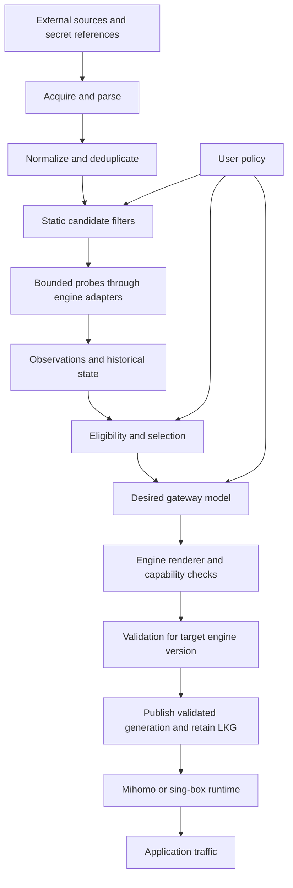

# Architecture and domain language

Status: accepted boundaries with M1–M7 components implemented and later P1
sequencing designed. The
[ADRs](decisions/README.md) record durable choices; detailed designs distinguish
implemented behavior from future requirements.

## System shape

The pipeline is conceptual. Policy is an input to filtering and selection as
well as rendering; it is not a stage that first appears after selection.
Source refresh, probe scheduling, and desired-state reconciliation have separate
cadences. A single sequential loop must not wait for every endpoint probe before
responding to a policy change or confirmed outage.

## Terms

| Term | Meaning |
| --- | --- |
| Source | A configured origin of endpoint descriptions, including its credential references and refresh policy |
| Endpoint | A normalized external connection configuration; not a display name or a Kubernetes EndpointSlice |
| Endpoint identity | Versioned logical endpoint ID plus a confidential connection revision; current health is revision-specific |
| Provenance | Sources and source-local records contributing an endpoint, with per-source presence times |
| Destination | A named target or class of traffic whose reachability matters; not automatically a probe URL |
| Probe profile | Versioned check definition, destination, timeout, and success criteria |
| Observation | One measured result with endpoint/profile/revision, time, execution vantage, and outcome |
| Health summary | Freshness-aware aggregation of observations; unknown and stale are distinct from observed failure |
| Pool | Candidates and derivation policy, including filters, probes, and selection intent |
| Selection decision | Chosen endpoint set/order plus bounded reasons and the input snapshot revision |
| Policy | Desired destination/routing/group behavior independent of an engine syntax |
| Gateway | Desired configuration target and its publication/runtime association |
| Renderer | Engine/version-specific transformation of desired model into an artifact |
| Generation | A desired artifact revision; separate from Kubernetes `metadata.generation` and artifact content digest |
| Last-known-good (LKG) | Retained, successfully published, validated artifact; not evidence of runtime activation |
| Activation | Confirmation that a runtime loaded a particular generation; unknown for BYO unless reported |

Detailed identity rules belong in [endpoints and sources](designs/endpoints-and-sources.md).
Probe outcomes and summary semantics belong in [observations and selection](designs/observations-and-selection.md).

## Component boundaries and future code placement

There is one Go module. `internal/endpoint` implements M1, `internal/source`
implements M2, M3 is implemented by `internal/policy`, `internal/engine`,
`internal/artifact`, and `internal/publish`, M4 is implemented by
`internal/observation`, `internal/probe`, and `internal/state`, and M5 adds
`internal/selection`, shared use-case composition in `internal/reconcile`, plus
receipt-bound decision checkpoints in `internal/state`. M6 adds generated
`api/v1alpha1`, thin `internal/controller` reconcilers, Kubernetes adapters in
`internal/operator`, and `cmd/operator`. M7 adds the managed runtime planner,
immutable generation/auth publication and activation observer in `internal/operator`
plus the fixed `cmd/healthcheck` readiness helper. `tools/checkdocs` is repository tooling;
there is no standalone product CLI yet. The remaining paths are
placement guidance, **not directories to pre-create**. Introduce packages with their
first real consumer; combine closely related code until a tested dependency boundary
warrants splitting it.

| Responsibility | Intended location when implemented | Dependency constraint |
| --- | --- | --- |
| Normalized endpoint types and identity | `internal/endpoint` | No Kubernetes or engine imports |
| Acquisition adapters and subscription parsers | `internal/source` (implemented M2 slice) and format-specific children when justified | Produce normalized input; cannot publish output |
| Observation evidence and summaries | `internal/observation` (implemented M4) | Revision/target/vantage-specific value types; no scheduler or SQL dependency |
| Probe scheduling and engine execution | `internal/probe` (implemented M4) | Pinned engines behind a narrow adapter; no proxy-protocol implementation |
| History reads/writes and SQLite adapter | `internal/state` (implemented M4/M5) | Domain-shaped operations; no generic ORM or backend framework |
| Eligibility, scoring, selection | `internal/selection` (implemented M5) | Deterministic inputs; no I/O or Kubernetes types |
| Common routing and desired gateway model | `internal/policy` (implemented M3 slice) | No native engine maps in common semantics |
| Engine configuration and validation | `internal/engine/mihomo`, `internal/engine/singbox`, `internal/artifact` (implemented M3 profiles) | Engine dependencies stay here; no publication side effects |
| File and Secret publication | `internal/publish` (file M3); Secret adapter in `internal/operator` (M6) | Consume validated artifacts; serialize writes per target |
| Shared reconciliation/use cases | `internal/reconcile` (implemented M5 standalone slice) | Explicit consumers of adapters; no Kubernetes client dependency |
| Standalone process composition | `cmd/egressfox` | Thin flags, lifecycle, dependency wiring |
| Kubernetes API and reconcilers | Kubebuilder-generated `api/v1alpha1`, `internal/controller`; adapters and managed runtime planner in `internal/operator` (implemented M6/M7) | Convert Kubernetes objects to core inputs; never invert this dependency |
| Operator and readiness processes | `cmd/operator`, fixed managed listener probe in `cmd/healthcheck` (implemented M6/M7) | Preserve supported scaffold conventions; health helper proves authentication only and never proxies traffic |

Do not introduce a shared `utils`, a public Go SDK, empty interfaces for every
pipeline arrow, a plugin RPC protocol, or a distributed service for each stage.
Interfaces belong at actual consumers of side effects. Clock and random input
must be controllable for selection replay. Use `context.Context` for cancellable
I/O, contextual sanitized errors, explicit dependencies, and small packages.

The official [Go module layout guidance](https://go.dev/doc/modules/layout)
supports starting small and using `internal` for non-public packages. It does
not require a generic community project tree.

## Reconciliation and consistency

The shared use case assembles an immutable input snapshot: desired policy revision,
source/inventory revisions, endpoint credential revisions, observation cutoff,
previous selection, and engine compatibility profile. It derives a decision and
artifact without fetching fresh network data halfway through rendering.

Repeated reconciliation of the same snapshot and explicit clock/seed must give
the same decision and bytes. In a running system observations evolve; idempotency
means repeated handling of the same effective inputs has no additional side
effects, not that traffic conditions are frozen.

Before publication, reject obsolete work using the current desired revision and
the target's recorded generation. A slow render from an older policy must not
overwrite a newer result. Writes are serialized per target; Kubernetes resource
versions provide conflict detection, not a substitute for semantic revision checks.
Retries reconstruct desired state rather than assuming an event sequence.

No transaction spans the history database, filesystem, API server, and engine.
Publication therefore needs recoverable checkpoints and read-back after ambiguous
writes. The [publication design](designs/policy-rendering-publication.md) owns
crash behavior, target ownership, and the distinction between validation and activation.

## Failure boundaries

| Failure | Intended response |
| --- | --- |
| Source timeout or invalid response | Record refresh failure; never interpret it as an authoritative empty inventory |
| No fresh observations | Preserve unknown/stale evidence; apply explicit eligibility policy |
| Insufficient candidates | Report a shortfall; never silently relax deny rules or route directly |
| Unsupported renderer semantics | Fail with capability/field context and retain current published artifact |
| Native validation failure | Suppress publication and expose sanitized diagnostics |
| Publication conflict or ambiguous write | Read back and retry within bounds; do not blindly promote state |
| Lost history | Explicit cold-start/recovery policy; no fabricated healthy state |
| Data-plane failure after validation | Report separately where observable; validation is not an availability guarantee |

## Standalone and Kubernetes

Standalone and operator modes compose the same core behavior. Kubernetes is an
adapter for desired input, scheduling signals, Secret access/output, ownership,
and bounded status. The core must not know a namespace, CRD, Kubernetes Condition,
or API server resource version.

P0 uses one namespace-scoped operator replica, leader election and one RWO-PVC-backed
SQLite store as defined by [ADR 0011](decisions/0011-namespaced-byo-operator.md).
It does not authorize shared SQLite or multiple replicas.

## Design navigation and non-goals

- [Sources and endpoint identity](designs/endpoints-and-sources.md): untrusted input to inventory.
- [Observations, history, selection, and observability](designs/observations-and-selection.md): evidence to decisions.
- [Policy, renderers, and safe publication](designs/policy-rendering-publication.md): decisions to artifacts.
- [Kubernetes](designs/kubernetes.md): implemented P0 APIs and reconciliation ownership.
- [Threat model](security/threat-model.md): trust boundaries and required controls.

Transparent networking, per-connection decisions, HA storage, and a public extension
SDK are not part of this foundation. Track unresolved details in the
[decision queue](decisions/open-questions.md) rather than making them implicit in code.

The [P1 roadmap](roadmap/p1.md) preserves these boundaries while adding managed
process ownership around an existing engine, not a new data plane. It orders runtime
activation before resilient sources, target-aware selection, routing composition,
metrics and explainability so later APIs consume explicit lifecycle/evidence states.
