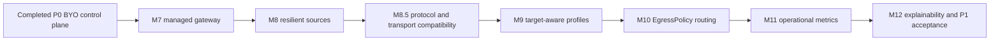

# P1 product roadmap

Status: active implementation plan. M7–M8 are complete; M8.5 protocol and
transport compatibility is next, followed by M9.

M8's compatibility completion adds documented HTTP client request profiles and
bounded URI/JSON subscription formats, including extraction from Xray/V2Ray
client-config outbounds. Its exact supported protocol subset is in the
[compatibility matrix](../designs/subscription-compatibility.md); Reality/Vision
and arbitrary native configuration composition remain future work.

This document is the authoritative P1 objective, scope, milestone order and
acceptance contract. The [roadmap index](README.md) preserves completed P0 history,
the [feature catalog](features.md) owns priority classification, and the owning
designs define detailed semantics. The accepted
[post-P1 runtime/publication architecture](../designs/runtime-and-standalone.md)
and [artifact/composition architecture](../designs/artifact-publication-and-composition.md)
constrain later work without adding P1 implementation scope. Future implementation
plans may decompose one milestone into focused branches, but must not silently
change this sequence or add scope.

## Product objective

P1 makes EgressFox a self-contained, namespace-scoped egress service: an operator
can define sources, target-aware pools, a gateway and bounded routing intent, and
receive an authenticated proxy Service whose exact configuration activation,
runtime readiness and control-plane decisions are observable and explainable.

Mihomo and sing-box remain the data plane. EgressFox owns desired configuration,
managed process lifecycle and evidence about activation; it does not proxy traffic,
make per-connection choices, or claim application-path health from a ready Pod.

The intended P1 experience is:

```text
install EgressFox
      |
define sources and target-aware pool profiles
      |
define a managed gateway and optional routing policy
      |
receive a revision-bound authenticated SOCKS Service
      |
observe published, activated and runtime-ready state
      |
inspect bounded reasons and metrics when behavior changes
```

BYO mode remains supported. A managed runtime is an additional mode, not a migration
that lets the operator adopt or restart user-owned workloads.

## Scope tiers

### Must-have P1 path

1. M7 — managed single-replica SOCKS gateway and activation evidence;
2. M8 — resilient HTTP source refresh and protected source cache;
3. M8.5 — practical protocol and transport compatibility with documented,
   engine-specific combinations and end-to-end traffic evidence;
4. M9 — target-aware selection profiles over one shared inventory;
5. M10 — one bounded `EgressPolicy` per gateway and common ordered routing;
6. M11 — a low-cardinality operational metrics contract;
7. M12 — bounded explainability CLI and P1 acceptance scenarios.

Every milestone keeps both exact supported engine profiles unless its entry gate
demonstrates that a requested common semantic cannot be implemented truthfully.
Engine asymmetry is reported as an unsupported capability; it is never approximated.

### Optional P1 candidates

These ideas may be scheduled only through an explicit roadmap revision after the
must-have path demonstrates a concrete need:

- live-reload adapters after restart-based activation is reliable;
- managed runtime replicas, PodDisruptionBudget and topology controls after
  generation acknowledgment works for one replica;
- a source-provenance diversity constraint after multi-source attribution is fixed;
- one further protocol slice beyond M8.5 chosen from usage evidence and
  renderer parity;
- subscription quota/expiry display as attributed, untrusted metadata.

Optional does not mean implicitly accepted API. None is an exit criterion for P1.

### Deferred beyond P1

- operator HA, shared persistence and PostgreSQL;
- cross-namespace references or cluster-wide Secret access;
- Vault/S3/filesystem/stdout external publisher adapters and `EgressOutput` API;
  these are accepted post-P1 direction, not P1 implementation;
- generic webhook/HTTP output and arbitrary ConfigMap output;
- engine-native base configuration, arbitrary patching or deep merge;
- country/ASN/provider enrichment and diversity constraints based on data that does
  not exist or cannot be attributed reliably today;
- transparent workload routing, selectors that imply attachment, sidecar injection,
  TUN/TProxy, Cilium, eBPF or admission mutation;
- Web UI, rich TUI, a second Rust control-plane/core, predictive selection and
  custom scoring code; a future unrelated TUI remains undecided;
- protocol families and combinations beyond the explicit M8.5 contract, and
  unsupported engine-version expansion.

Credential-bearing complete configurations remain Secrets. A ConfigMap becomes
eligible only for a future output proven credential-free end to end. File and
environment sources do not reduce the Kubernetes user's current setup burden enough
to precede managed HTTP refresh. External publisher adapters are deliberately
post-P1; their future inclusion follows the accepted architecture and real backend
contracts, not adapter symmetry.

## Dependency order



M8 removes the need for users to keep subscription Secrets refreshed. M8.5
establishes which connections that inventory can faithfully operate before M9
multiplies target profiles over it. M10 needs named profile outputs.
M11 and M12 follow the final P1 state model so their public contracts do not churn
with each preceding API change. Every earlier milestone still adds the bounded
Conditions and metrics needed to operate its own behavior.

## Common lifecycle vocabulary

P1 preserves four separate states:

| State | Meaning | Does not prove |
| --- | --- | --- |
| Desired | A coherent current input snapshot produced an intended artifact/runtime revision | Validation, publication or availability |
| Published | Exact bytes passed native validation and exist in an operator-owned target | A process loaded those bytes |
| Activated | A managed process generation is bound to those exact published bytes and acknowledged startup | Continued readiness or destination traffic |
| Runtime ready | The activated managed process is currently ready and serving its configured proxy listener | Any arbitrary application request or endpoint remains healthy |

BYO mode can report Desired and Published. Activated and Runtime ready remain
`Unknown` unless a future explicit BYO acknowledgment adapter is configured; Secret
projection alone never advances either state.

The first managed path restarts a process through a revision-bound Deployment
rollout. It does not expose an engine control API. Mihomo 1.19.31 has an authenticated
REST reload endpoint, while sing-box 1.14.1 handles `SIGHUP` by checking, closing and
recreating its instance. Those are useful future engine adapters but not one common
atomic contract. A new Pod reading an immutable generation Secret gives both engines
the same observable start boundary. Deployment completion and readiness are still
process/listener evidence, not traffic success.

## API direction and compatibility

`egressfox.io/v1alpha1` remains the storage version through P1 unless an individual
milestone proves conversion is required. Alpha permits additive evolution, not
silent reinterpretation of existing objects.

| Resource | P1 direction | Compatibility rule |
| --- | --- | --- |
| `ProxyPool` | Keep one source inventory; add bounded named probe/selection profiles and managed HTTP source variants | Existing Secret sources and single `probe`/`selection` behavior continue as the legacy/default profile until a documented migration exists |
| `EgressGateway` | Add an explicit BYO/managed runtime union, a selected profile or policy reference, and activation/runtime Conditions | Omitted runtime remains BYO; existing `poolRef`, listener and output Secret behavior cannot become managed implicitly |
| `EgressPolicy` | New namespaced resource for ordered data-plane routing intent over named pool profiles | A gateway references at most one policy; there is no multi-policy merge or hidden precedence |

`EgressPolicy` does not select or mutate workloads. Applications opt in by configuring
the managed Service as a proxy. It is not a NetworkPolicy replacement and its name
does not imply transparent routing.

Exact fields, defaults and validation are milestone entry gates. In particular,
making the currently required `outputSecretName` BYO-specific needs stored-object,
schema and rollback review. Do not add parallel fields that can disagree without
mutual-exclusion validation and a deterministic conversion rule.

## M7 — Managed single-replica gateway and activation

**Status: complete (2026-09-22).** The accepted contract is
[ADR 0013](../decisions/0013-managed-gateway-activation.md), implementation evidence
is recorded in [plan 0011](../plans/0011-managed-gateway.md), and operating details
are in the [Kubernetes guide](../operations/kubernetes.md).

**User problem solved.** P0 stops at a Secret; users must build, secure, expose,
restart and diagnose an engine workload themselves. M7 turns the current one-pool
gateway into a usable in-namespace SOCKS Service while retaining BYO behavior.

**Why P1.** This closes the largest gap between a correct control-plane decision and
something an application can use. It reuses the existing exact renderer, validator,
publication receipt and Kubernetes ownership boundaries instead of adding policy
breadth first.

**Dependencies and entry gates.** P0/M6, Q7 activation semantics and Q13 managed
runtime ownership/API. Before CRD generation, record a durable decision covering
the runtime union, client authentication, listener exposure, runtime image authority,
generation Secret retention, rollout failure and deletion behavior.

**API changes.** Add a mutually exclusive managed runtime stanza while omission
preserves BYO. The first managed mode is one replica and one authenticated SOCKS
listener behind a ClusterIP Service. Image/version selection comes from the trusted
EgressFox release/operator configuration, not an arbitrary per-Gateway container
image. Status distinguishes `Published`, `Activated` and `RuntimeReady` with safe
reasons and no content digest. Exact field names remain Q13 work.

**Core changes.** Extend the desired listener contract only as needed for an
authenticated Pod-network SOCKS listener. The managed composition may bind a Pod
interface; the existing loopback-only BYO contract does not silently broaden.
Renderer capability checks must prove both exact engine profiles implement the same
inbound authentication and listener semantics.

**Kubernetes changes.** Reconcile exclusively owned generation Secrets, one
Deployment and one ClusterIP Service. The Deployment mounts one immutable Secret,
starts a fresh exact-profile process without a shell or control API, and uses a
revision-changing Pod template. Use a rolling strategy that keeps the old ready Pod
while the new one is unavailable. Activation requires the latest Deployment
generation to be fully updated and its engine readiness probe to pass. Retain the
previous active Secret until the new generation activates; bound later cleanup.
Create a least-privilege NetworkPolicy as defense in depth, while documenting that
enforcement depends on the CNI and therefore cannot replace proxy authentication.

**Security implications.** Never create an unauthenticated cluster-wide open proxy.
Client credentials are Secret-backed, omitted from status/logs and distinct from
engine control credentials. Pods remain non-root with read-only root filesystems,
dropped capabilities, bounded writable state and no host networking, TUN or
`NET_ADMIN`. The proxy Service is ClusterIP only. The operator never adopts an
unowned Deployment, Service or Secret.

**Persistence implications.** Activation state must bind the protected artifact
receipt to the exact owned Secret and Deployment generation across restart. Do not
publish confidential artifact digests as annotations or status. Kubernetes objects
are recoverable truth for workload state; SQLite retains decision checkpoints, not
a duplicate Deployment database.

**Testing requirements.** Unit ownership/desired-object tests, envtest schema and
status transitions, kind rollout interruption/restart/deletion tests, both exact
engine profiles, authenticated SOCKS traffic, invalid-generation LKG preservation,
old-Pod retention during failed rollout, credential redaction and negative RBAC.

**Migration and compatibility.** Existing Gateways remain BYO with identical output
Secrets and `Activated=Unknown`. Switching mode is explicit and must not adopt or
delete a user workload. Downgrade guidance must explain managed child retention and
unsupported new fields.

**Non-goals.** Live reload, HTTP proxy listener, replicas greater than one, PDB,
affinity/topology tuning, external Service types, workload mutation, transparent
routing, traffic-level health and operator HA.

**Exit criteria.** On a clean kind cluster, one manifest creates an owned,
authenticated SOCKS Service for either engine; a validated generation causes a
revision-bound rollout; status advances Published then Activated then RuntimeReady;
an invalid or unready replacement leaves the previous ready generation serving; BYO
tests and API behavior remain green.

## M8 — Resilient HTTP source refresh

**User problem solved.** Kubernetes users currently copy subscription bytes into
Secrets and keep them refreshed outside EgressFox. Transient provider failures have
no durable HTTP cache or conditional refresh behavior.

**Why P1.** Owning safe refresh removes recurring infrastructure from the normal
installation and directly improves the freshness of the inventory feeding the
managed gateway.

**Dependencies and entry gates.** M7 establishes the P1 Gateway/status vocabulary;
Q14 must define the source API, protected cache schema, freshness/expiry policy,
conditional-request identity and retry budget.

**API changes.** Evolve each `ProxyPool` source into a validated union: the existing
Secret snapshot or a managed HTTP(S) source whose URL and sensitive headers are
same-namespace Secret references. Keep explicit format/admission flags. Plain HTTP,
private destinations and insecure TLS remain separate trusted opt-ins. Report safe
last-success, cache-use, staleness and failure Conditions without URLs or validators.

**Core changes.** Layer conditional `ETag`/`Last-Modified` requests, bounded
retry/backoff and a last-known-good content cache around the existing acquisition
and transactional snapshot boundary. A source refresh or cache update is not by
itself a new artifact generation or runtime rollout; compare the final deterministic
validated artifact. A 304 reuses a matching cache; it is never an empty source.
Cache fallback is time-bounded and never converts an acquisition or parse failure
into authoritative empty input.

**Kubernetes changes.** Schedule source refresh independently of API reconcile
workers, enqueue affected pools/gateways on committed revision change and cancel
work on leadership loss. Secret rotation for URL/header material invalidates the
appropriate HTTP cache identity without exposing it.

**Security implications.** Preserve all P0 SSRF, redirect, byte, timeout and
same-origin credential controls on every retry. Cache bodies, validators and request
metadata share the source credential boundary. Retry/backoff must not amplify a
provider outage or leak authorization cross-origin.

**Persistence implications.** Store only the bounded content and metadata needed to
reconstruct the last accepted source revision in a protected durable cache with
schema/version/retention rules. Do not put subscription bodies in CR status or
ordinary logs, and do not conflate source cache LKG with published artifact LKG.

**Testing requirements.** Conditional 304, changed validator, cache mismatch,
restart, expiry, corrupt cache, provider timeout, retry exhaustion, auth rotation,
redirect/SSRF and transactional parse failure tests; fake clocks/servers and
deterministic backoff inputs; envtest and kind restart evidence.

**Migration and compatibility.** Existing Secret sources are unchanged. Adding an
HTTP variant is additive; changing a source variant is a new source revision and
must not inherit incompatible cache state.

**Non-goals.** File/environment/ConfigMap/Vault sources, cross-origin auth,
unbounded offline operation, provider quota enforcement and structured engine-native
subscription formats.

**Exit criteria.** A Secret-referenced HTTPS source refreshes conditionally, survives
operator restart with an attributable bounded cache, preserves the previous admitted
inventory through bounded transient failure, expires visibly, and cannot bypass P0
network or redaction controls.

## M8.5 — Protocol and transport compatibility

**Status: mandatory and unimplemented.** M8, including its bounded subscription
compatibility and final hardening, remains complete. The current supported subset
is the [subscription compatibility matrix](../designs/subscription-compatibility.md).
M8.5 addresses the common connection forms found in real subscription sources;
M9 follows it. The [M8.5 plan](../plans/0020-m85-protocol-transport-compatibility.md)
tracks the ordered slices without redefining this scope.

**Required protocol families.** VLESS, VMess, Trojan, Shadowsocks, SOCKS5,
HTTP and HTTPS proxies, and Hysteria2. Common applicable transports to research
include TCP, WebSocket, HTTP/2, HTTPUpgrade, gRPC and XHTTP. Connection-critical
security and protocol fields include TLS, Reality, SNI, ALPN, uTLS fingerprints,
Vision flow and applicable authentication and QUIC parameters. A named family or
transport is not a promise that every cross-product combination is valid. C1 must
establish the exact valid, representable combinations against the repository's
pinned Mihomo and sing-box builds; engine-specific gaps remain explicitly
unsupported rather than approximated as parity.

| Slice | Dependency and responsibility | Exit gate |
| --- | --- | --- |
| C1 — Canonical endpoint model and engine capabilities | Research actual subscription representations and both exact engine profiles; decide typed connection fields, canonical identity/version and protected revision behavior, observation migration or invalidation, and capability checks per engine/version/build. | A reviewed supported/unsupported combination matrix and design decisions precede code; model, identity, deduplication and capability tests prove old identities/evidence remain valid or migrate/invalidate safely. |
| C2 — Main proxy protocols | After C1, complete the documented supported configurations for VLESS, VMess, Trojan, Shadowsocks, SOCKS5 and HTTP/HTTPS proxies. | Each claimed form passes bounded ingestion, canonicalization, capability rejection, each applicable renderer, exact native validation, controlled through-engine probe and managed Gateway traffic; existing variants regress green. |
| C3 — Advanced transports and Reality | After C2, implement applicable HTTP/2, HTTPUpgrade, gRPC, XHTTP, TLS/Reality, SNI, ALPN, uTLS and Vision combinations identified by C1. | Connection-critical options survive source-to-engine translation, including negative cases for unsupported engine/transport/security combinations; no downgrade or substituted transport; native validation, probe and managed traffic evidence for each claim. |
| C4 — Hysteria2 and QUIC | After C3, implement the C1-qualified Hysteria2/QUIC connection model, authentication, congestion and other applicable network parameters, UDP authorization and probe execution. | Exact-profile native validation and controlled QUIC traffic through managed Mihomo and sing-box where supported, with explicit rejection of unsupported variants and no bypass of network policy. |

M8.5 is complete only when every **claimed** combination passes the same path:
subscription → endpoint model → canonical identity/deduplication → exact engine
capability validation → rendering → native validation → controlled through-engine
probe → managed Gateway traffic. A URI that parses or a configuration that merely
passes syntax validation is insufficient. The matrix records unsupported
combinations and engine asymmetry. Every slice preserves M1–M8 source admission,
SSRF/redaction, confidential identity and observation boundaries, cache and
last-known-good behavior, artifact equality and exact-generation activation.
EgressFox does not implement proxy protocols or import subscription routing,
listeners, DNS policy or arbitrary native configuration composition.

## M9 — Target-aware selection profiles

**User problem solved.** One `ProxyPool` has one probe target and selection policy,
so users must duplicate the same source configuration to choose differently for two
destinations.

**Why P1.** M4/M5 already key evidence and decisions by target/profile context. M9
exposes that leverage cleanly before routing policy consumes it.

**Dependencies and entry gates.** M8 supplies a reliable shared inventory. Q15 must
fix profile identity, legacy-field mapping, status bounds, scheduler budgets and
policy fingerprints.

**API changes.** Add a bounded map-list of named probe/selection profiles to
`ProxyPool`. Profiles reuse one source inventory and each reference their own target,
probe settings and selection policy. Existing single `probe`/`selection` fields map
to a reserved default profile during the alpha migration. A legacy Gateway can
select that default; an additive profile reference selects another.

**Core changes.** Reuse existing target/revision/vantage/profile dimensions and pure
selector. Make named profile identity an adapter concern, not part of endpoint
identity. Preserve deterministic Top-N, separate anti-flapping state and explanations
for every evidence context. One leaf inventory may be evaluated under multiple
profiles; preserve the ability for later policy to compose multiple
`(ProxyPool, Profile)` inputs without duplicating source inventories.

**Kubernetes changes.** Schedule the bounded inventory-by-profile matrix without
unbounded jobs or reconcile blocking. Status reports bounded per-profile readiness
and counts plus aggregate Conditions; it never embeds observations or endpoint lists.

**Security implications.** Every profile target keeps independent authorization.
Adding one target does not authorize another or expand endpoint network policy.
Profile names and target IDs are safe labels; URLs remain in Secrets.

**Persistence implications.** Existing observation keys and decision contexts
already separate target revisions. Schema changes are permitted only if needed for
bounded profile lifecycle/retention, with restart and profile-removal cleanup tests.

**Testing requirements.** Same inventory/two targets with different outcomes,
profile reorder determinism, target credential/revision changes, scheduler capacity,
independent cooldown/residence, profile deletion and restart replay in core,
envtest and controlled kind traffic.

**Migration and compatibility.** Existing objects remain a one-profile pool. Reject
simultaneous legacy and new profile declarations unless the conversion rule proves
they are identical; never choose one by field order.

**Non-goals.** Routing rules, source duplication, target-wide incident correlation,
country/ASN enrichment, diversity constraints and distributed probe vantages.

**Exit criteria.** One admitted source inventory drives at least two independently
probed and selected named profiles with deterministic state and bounded status, and
a Gateway can consume either without duplicating subscription configuration.

## M10 — EgressPolicy and bounded routing

**User problem solved.** P0 renders one selected set behind one final route. Users
cannot express that destinations use different target-aware selections or explicitly
choose direct/block behavior.

**Why P1.** This completes the source/pool/gateway/policy product vocabulary while
keeping per-connection routing inside the engines.

**Dependencies and entry gates.** M9 named profile outputs; Q16 must prove the exact
common semantic subset against both engine versions and define ordered matching,
DNS behavior, references, infeasible groups, status and migration. Candidate sets
must leave room for bounded named compositions of multiple leaf
`(ProxyPool, Profile)` inputs; do not make one candidate Pool per Gateway a
permanent architecture constraint. Pools remain non-recursive leaf inventories.

**API changes.** Add namespaced `EgressPolicy`. A Gateway references either its
legacy pool/profile or exactly one policy; policies are never merged. A policy owns
a bounded ordered rule list, named candidate groups composed from one or more
pool/profile inputs, and an explicit final action. The initial target is
exact/suffix domain, CIDR and TCP destination-port
matching with explicit profile, direct or block actions, only after exact-version
parity tests confirm the semantics. No workload selector belongs in this resource.

**Core changes.** Expand `internal/policy` into typed engine-independent groups,
ordered matches/actions and explicit final behavior. Keep leaf inventory separate
from selection output and candidate composition. Deduplicate overlapping
full connection identities in the rendered engine configuration while retaining
all contributing source provenance and each Pool/Profile/group membership. Keep
profile-specific evidence and selection separate. Evaluate eligibility and
selection only against the matching target/profile context; distinct credential
revisions remain distinct connections. Pools never reference pools; do not add a
ProxyGroup CRD without new evidence. Validate missing/empty groups, reference
cycles, rule order, duplicate names and unsupported semantics before rendering.
Renderers reject rather than weaken engine asymmetry.

**Kubernetes changes.** Add generated CRD/RBAC and a focused policy acceptance
reconciler or equivalent ownership boundary. Index policy-to-pool and gateway-to-
policy references. Gateway publication rechecks every referenced object revision
before commit. Policy status reports acceptance/conflict only, not traffic counters.

**Security implications.** `direct` is explicit and never an empty-pool fallback;
`block` cannot be dropped. DNS resolution location and CIDR matching must be
documented per profile. Rule-set fetching, scripts and engine-native hooks are not
accepted policy input.

**Persistence implications.** The complete accepted policy revision participates in
the deterministic policy fingerprint and selection/publication checkpoint. Routing
policy itself remains Kubernetes desired state, not duplicated in SQLite.

**Testing requirements.** Cross-engine goldens/native validation, ordered-rule and
final-action cases, DNS/CIDR/port parity fixtures, missing/empty profile behavior,
stale policy publication guard, API validation/default/upgrade tests, envtest watch
mapping and kind traffic for proxy/direct/block paths.

**Required multi-pool acceptance scenario.** Independently owned
`ProxyPool/germany` and `ProxyPool/finland` each provide a target-aware candidate
set to one bounded `EgressPolicy` candidate group referenced by an `EgressGateway`.
Include the same full connection identity in both pools: the composed rendered
configuration contains one engine proxy entry for that connection, while retaining
both source provenances and both Pool/Profile/group memberships. Include the same
logical endpoint at a different credential revision and verify it remains a
separate connection. Evaluate that endpoint under a second target profile with
different fixture observations and verify the evidence, eligibility, score and
selection remain profile-specific; the endpoint may still belong to a separate
candidate group for that profile. Verify that generated routing references the
intended composed group and that both exact engine versions render and natively
validate it. This scenario requires composition across distinct pools, not merely
multiple profiles from one pool, and does not require recursive pools or another
CRD.

**Migration and compatibility.** Existing `poolRef` Gateways retain the implicit P0
one-group/final-proxy policy. Moving to `policyRef` is explicit and mutually
exclusive. No existing object is auto-created or rewritten.

**Non-goals.** Multiple policies per Gateway, workload attachment, remote rule sets,
UDP, URL-test/fallback/load-balance groups, sticky/consistent-hash behavior, native
fragments and arbitrary engine fields.

**Exit criteria.** One Gateway renders and activates a deterministic policy with
at least two named profile selections and explicit final behavior on both engines,
including one candidate group composed from at least two distinct ProxyPools. The
overlap, provenance, credential-revision and profile-evidence requirements in the
multi-pool acceptance scenario pass. Unsupported or infeasible policy retains LKG;
BYO and legacy implicit policy still work.

## M11 — Operational observability

**User problem solved.** Conditions show current object state but operators cannot
trend refresh, probe, selection, publication, activation and runtime failures across
the control loop.

**Why P1.** A managed service is not operable without a stable metrics contract, and
P0 already has bounded domain counters ready for an adapter.

**Dependencies and entry gates.** M7–M10 establish the final P1 stages and reasons.
Metric names, units, label enums and removal behavior must be reviewed as a public
compatibility surface before release. Include bounded desired/active generation,
candidate rollout failure and no-op/repair evidence without exposing confidential
artifact identity.

**API changes.** No CRD is required. Existing Conditions remain the per-resource
diagnostic surface. An optional Helm ServiceMonitor must be disabled by default and
must not make Prometheus Operator a required dependency.

**Core changes.** None to decision semantics. Add consumer-side observations around
existing use-case results; do not insert a metrics dependency into pure domain
packages.

**Kubernetes changes.** Export documented `egressfox_*` counters, gauges and
histograms for source, probe, selection, render, publish, activation and runtime
stages through the authenticated metrics endpoint. Provide an optional ServiceMonitor,
example alerts and a versioned Grafana dashboard only for supported metrics.

**Security implications.** Default labels are bounded enums such as engine, stage,
result and reason. No resource names, endpoint IDs, URLs, destinations, Secret names,
revisions or arbitrary errors. Enforce a series/cardinality budget in tests.

**Persistence implications.** Metrics are process observations and are not persisted
to SQLite. Current-state gauges reconstruct after restart; counters reset normally.

**Testing requirements.** Registry gather tests, unit/name checks, bounded label-set
tests, duplicate-registration/restart behavior, authenticated scrape and optional
ServiceMonitor Helm rendering. Alert examples require deterministic promtool checks
if promtool is introduced and pinned.

**Migration and compatibility.** P0 controller-runtime metrics remain. New metric
families need lifecycle documentation; renames require an intentional compatibility
window once publicly released.

**Non-goals.** Per-endpoint time series, arbitrary CR-name labels, OpenTelemetry,
log aggregation, mandatory Prometheus Operator installation and availability SLOs.

**Exit criteria.** Every P1 lifecycle stage has a documented bounded metric or an
explicit reason why Conditions are the correct surface; a secured scrape and example
dashboard work in kind without cardinality growth proportional to endpoint count.

## M12 — Explainability CLI and P1 acceptance

**User problem solved.** The core retains structured reasons, but users cannot ask
why a Gateway selected, excluded or replaced candidates without reading operator
logs or protected state.

**Why P1.** Explainability is a defining product property and makes the new routing
and activation layers supportable. A narrow Kubernetes explain client is justified
by this concrete use case; it is not the full standalone product CLI or daemon.

**Dependencies and entry gates.** M7–M11; Q17 must fix the narrow explain
command/exit behavior, authorization, bounded report schema, opt-in disclosure and
retention. Q11 owns the separate post-P1 general standalone CLI contract. No CLI
reads raw Secrets or SQLite over an ad hoc path.

**API changes.** Add only a bounded latest-decision summary suitable for authorized
Kubernetes readers, either as an explicitly enabled Gateway status section or another
reviewed Kubernetes-native read boundary. It may contain safe logical endpoint IDs,
bounded reason enums/counts, selected order, transition class and lifecycle state;
never private revisions, aliases by default, URLs, native config or artifact digests.

**Core changes.** Reuse the existing immutable decision explanation and redaction
types. Define deterministic truncation and aggregate counts so omitted candidates
remain visible as a count rather than disappearing silently. Explain artifact
generation changes, deliberate no-change, same-generation output repair and failed
candidate activation where the authorized bounded report supports them.

**Kubernetes changes.** Add least-privilege read RBAC and status update behavior with
no reconcile loop on explanation-only timestamps. The CLI uses normal kubeconfig
authentication/authorization and reads declared API state; it does not exec into the
operator or expose an unauthenticated debug server.

**Security implications.** Explanation exposure is explicit, bounded and documented
as operational metadata. Redaction canary tests cover text, JSON, errors and status.
The CLI never prints Secret data or a credential-derived diff.

**Persistence implications.** Only the latest bounded decision report is exposed;
SQLite remains the protected history/evidence store. No CR becomes an observation
archive.

**Testing requirements.** Golden text/JSON output, deterministic truncation, exit
codes, missing/stale/forbidden states, kubeconfig/RBAC tests, credential canaries,
large-inventory status-size bounds and end-to-end explanations for ordinary switch,
emergency replacement and no-feasible selection.

**Migration and compatibility.** CLI/API schema is versioned while alpha. Existing
Gateways work without explanation enabled. Machine-readable output changes require
compatibility review once released.

**Non-goals.** Full standalone daemon or product CLI (`inspect`, `generate`,
`probe`, `validate`, `run`), raw configuration diff, kubectl plugin packaging, Web
UI, TUI or a second Rust core/workspace.

**Exit criteria.** An authorized user can run one documented Go CLI command against
a P1 Gateway and receive a bounded redacted explanation consistent with its status,
metrics and selected configuration. The complete managed-source/profile/policy
scenario passes upgrade, failure, recovery and both-engine kind tests, and P1 docs
describe its limits without an HA or traffic-availability claim.

## Research basis

Reviewed 2026-09-22 against the exact supported profiles and current Kubernetes
baseline:

- Mihomo's official [API documentation](https://wiki.metacubex.one/en/api/) and
  [v1.19.31 config route source](https://github.com/MetaCubeX/mihomo/blob/v1.19.31/hub/route/configs.go)
  describe authenticated `PUT /configs` reload behavior; its
  [general configuration](https://wiki.metacubex.one/en/config/general/) documents
  user authentication for SOCKS/HTTP listeners.
- sing-box
  [v1.14.1 run source](https://github.com/SagerNet/sing-box/blob/v1.14.1/cmd/sing-box/cmd_run.go)
  and [service unit](https://github.com/SagerNet/sing-box/blob/v1.14.1/release/config/sing-box.service)
  show `SIGHUP` validation followed by instance close/recreation; its
  [mixed inbound](https://sing-box.sagernet.org/configuration/inbound/mixed/)
  documents username/password clients.
- Kubernetes documents [Deployment completion and failure](https://kubernetes.io/docs/concepts/workloads/controllers/deployment/),
  [Pod readiness](https://kubernetes.io/docs/concepts/workloads/pods/pod-lifecycle/),
  [immutable Secrets](https://kubernetes.io/docs/concepts/configuration/secret/#immutable-secrets)
  and the fact that [NetworkPolicy enforcement depends on the network plugin](https://kubernetes.io/docs/concepts/services-networking/network-policies/).
- Prometheus [metric and label guidance](https://prometheus.io/docs/practices/naming/)
  rejects unbounded high-cardinality label values.

Recheck version-sensitive engine and Kubernetes behavior in each implementation
milestone. These sources support the sequencing decision; they do not prove the
future implementation.
